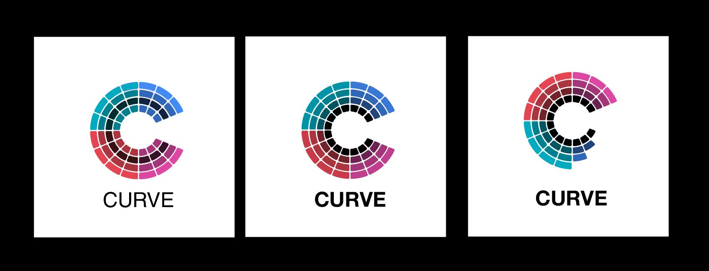
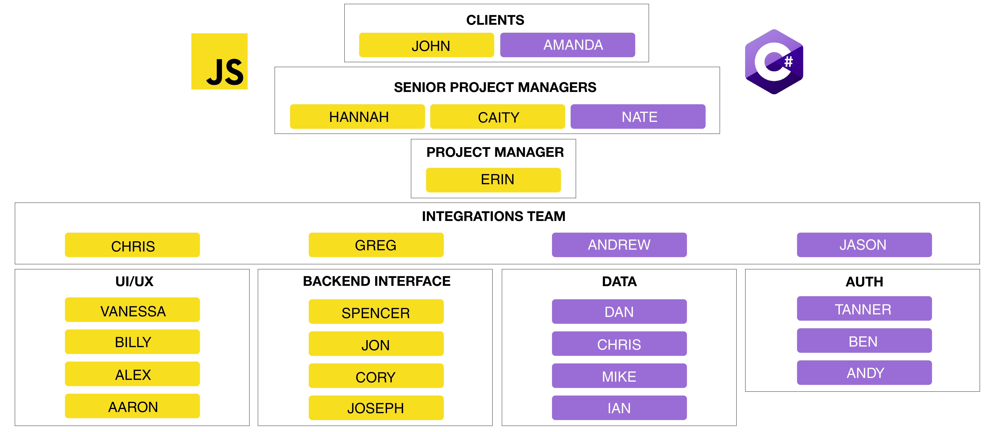

# 401 Snowflakes Final Project
This is a joint final project between the 401 Javascript and 401 ASP.Net classes at Code Fellows in Seattle, WA. The project will be completed in only 4 days between May 20 - May 24 2019.

---
## Project Name: Curve
---

Final logo approval pending

---

#### Goal
Recreate the Medium **_Snowflake_** app for Code Fellows employee and student core competancy evaluations. Adapt the core competancies used in the careers curriculum as metrics. The front end should use React, and Gatsby JS while the backend should serve the required data to the front end using GraphQL while providing for a variety of different roles and permissions.
The application will heavily reference the Medium's Snowflake [Original Source Code](https://github.com/CodeFellows-Curve/snowflake).

<!-- --- -->

<!-- #### Table of Contents
* [Project Board]()
* [Roles and Responsibilities]()
* [GitHub Workflow]()
* [Daily Schedule]()
* [Team Heirarchy]()
  * [Integrations Team Resources]()
  * [UI/UX Team Resources]()
  * [Backend Integration]()
  * [Data]()
  * [Auth]()
* [Meetings]()
  * [Meeting Notes]()
  * [Meeting Agendas]()
* [Project References]() -->

---

#### Notes from Client (Brooke)
_Conversation 5/16/19_: All of the sub competancies and main competancies will have a maximum score of 4. The snowflake should graphically show ALL of the main competancies and subcompetancies. Each primary compentancy will have a different color (or shade). Use the [Engineering Competancy Matrix Scoring Guide](https://docs.google.com/spreadsheets/d/131XZCEb8LoXqy79WWrhCX4sBnGhCM1nAIz4feFZJsEo/edit#gid=0) as a guide for the requirements to move to the next level in score.

---

#### Project Description
_Pending_

#### Jira Project Board
_Pending_

#### Roles and Responsibiities
_Pending_

#### GitHub Flow
_Pending_

 ---

<h2 style="padding:5px;border-style:solid;border-width:1px;border-color:black;" >Daily Schedule</h2>

  
8:45 -9:15 - Check in meeting

  
<b>Attendees</b>

    <ul>
      <li>PM</li>
      <li>Integrations Team</li>
      <li>Lead TAs</li>
    </ul>
  
<b>Agenda</b>

    <ul>
      <li>Plan for the day</li>
      <li>Big picture tasks for each group</li>
      <li>Any additional coordination times between smaller groups?</li>
      <li>Review planned agenda for the Big Scrum Meeting</li>
    </ul>

  
9:15 - Big Scrum Meeting - Approximately 30 min

  
<b>Attendees</b>

    <ul>
      <li>Clients</li>
      <li>Lead TAs</li>
      <li>PM</li>
      <li>Integrations Team</li>
      <li>Team Leaders</li>
    </ul>
  
<b>Agenda</b>

    <ul>
      <li>What each group will be working on</li>
      <li>Planned inter-team coordination meetings (if any)</li>
      <li>Clarification questions asked of the clients</li>
      <li>Identify any problems where TA help needed</li>
    </ul>

  
9:45 - Team Discussion (5-10 minutes)

  
<b>Attendees</b>

    <ul>
      <li>Integrations Team Representative</li>
      <li>Team Members</li>
    </ul>
  
<b>Agenda</b>

    <ul>
      <li>Team leader and Integrations team representative communicates team specific information from Big Scrum meeting to team.</li>
    </ul>

  
11:00 - 12:00 - Team Scrum Meetings (15 minutes per team)

  
<b>Attendees</b>

  <ul>
    <li>Clients</li>
    <li>All TAs</li>
    <li>PM</li>
    <li>Integrations Team Representative</li>
    <li>Team Members</li>
  </ul>

  
16:00-17:00 - Team Scrum Meetings (15 minutes per team)

  
<b>Attendees</b>

    <ul>
      <li>Clients</li>
      <li>All TAs</li>
      <li>PM</li>
      <li>Integrations Team Representative</li>
      <li>Team Members</li>
    </ul>
  
<b>Agenda</b>

    <ul>
      <li>How did the day go</li>
      <li>What was accomplished</li>
      <li>Plan for the next day</li>
    </ul>

  
17:00 - Integrations Team Daily Retrospective Meeting

  
<b>Attendees</b>

    <ul>
      <li>PM</li>
      <li>Integrations Team</li>
    </ul>
  
<b>Agenda</b>

    <ul>
      <li>What was accomplished today</li>
      <li>New tasks for the following day</li>
      <li>Things to discuss/ask at next day big scrum meeting</li>
      <li>Problems were additional resources are needed.</li>
    </ul>

***

<h2 align="center">Team Hierarchy</h2>

#### 

  
<b>Integrations Team</b>
 
  <b>&nbsp; &nbsp; Team Leader: </b>Erin Trainor  
  &nbsp; &nbsp; &#5852; Team Biographies  - Link Pending  
  <a href="https://docs.google.com/document/d/1RY_Ob5EYsAonB_acwMkEw99AdHmZTKBx20fd3x4WGxQ/edit?usp=sharing">&nbsp; &nbsp; &#5852; Group Agreement</a> 
  <a href="https://docs.google.com/document/d/104WMsb7SM3s68rgwwktQSdUjv_HaSqFyRajnlSDvFqo/edit?usp=sharing">&nbsp; &nbsp; &#5852; User Stories</a>  

  
<b>UI/UX - Javascript</b>
 
  <b>&nbsp; &nbsp; Integrations Team Point of Contact: </b>Chris Merritt 
  <b>&nbsp; &nbsp; Team Leader: </b>Vanessa Wei  
  &nbsp; &nbsp; &#5852; Team Biographies  - Link Pending  
  <a href="https://docs.google.com/document/d/1OPUpRXWkk1Dx0BmRjouBDBCOGXqrlE3Eh6Lt7vcCqz8/edit">&nbsp; &nbsp; &#5852; Group Agreement</a> 
  <a href="https://docs.google.com/document/d/1-sHkbBGCe7hSizhoMnbMEGOERKmqodXlm7vNn_8pXeo/edit?usp=sharing">&nbsp; &nbsp; &#5852; User Stories</a>  

  
<b>Backend Interface - Javascript</b>
 
  <b>&nbsp; &nbsp; Integrations Team Point of Contact: </b>Greg Dukes 
  <b>&nbsp; &nbsp; Team Leader: </b>Spencer Hirata  
  &nbsp; &nbsp; &#5852; Team Biographies  - Link Pending  
  <a href="https://docs.google.com/document/d/1zHWas520gGabNYsYsWhnB7dGbvR6hwNa1sw3Oxc140w/edit?usp=sharing">&nbsp; &nbsp; &#5852; Group Agreement</a> 
  <a href="https://docs.google.com/document/d/1JnWA1EmyUWowkoHwlc4e0SlBN4xHoipjro0CWolIrOg/edit">&nbsp; &nbsp; &#5852; User Stories</a>  

  
<b>Data - C#</b>
 
  <b>&nbsp; &nbsp; Integrations Team Point of Contact</b>Andrew Curtis 
  <b>&nbsp; &nbsp; Team Leader</b>Dan Logerstedt  
  &nbsp; &nbsp; &#5852; Team Biographies  - Link Pending  
  <a href="https://docs.google.com/document/d/14jUwk_TpGIYohoteQID2KzxtCYH_F5fuV8_K4IrYTjw/edit?usp=sharing">&nbsp; &nbsp; &#5852; Group Agreement</a> 
  <a href="https://docs.google.com/document/d/1AEAnTw2npca0iKJMauaP610BuPSltbU-WWCmumHbyzI/edit?usp=sharing">&nbsp; &nbsp; &#5852; User Stories</a> 
  <a href="https://docs.google.com/document/d/1ALGz_n_w2ro7ABXJRM1wrGTiiZpAuS7h_CFbI77kDxw/edit?usp=sharing">&nbsp; &nbsp; &#5852; Database Schemas</a>  

  
<b>Auth - C#</b>
 
  <b>&nbsp; &nbsp; Integrations Team Point of Contact</b>Jason Burns 
  <b>&nbsp; &nbsp; Team Leader</b>Tanner Percival 
  
&nbsp; &nbsp; &#5852; Team Biographies - Link Pending
 
  <a href="https://docs.google.com/document/d/1Fg3xK7r6AbVOKgL1zoLrj0qWStzJTY22sHFbpZYmt40/edit?usp=sharing">&nbsp; &nbsp; &#5852; Group Agreement</a> 
  <a href="https://docs.google.com/document/d/16IYEQbwUyXER-93ScNRK_hSLknBF_-xpLE8MxxJ7HzU/edit">&nbsp; &nbsp; &#5852; User Stories</a>  

  
<b>Languages Used</b>

  
&nbsp; &nbsp; JavaScript

  
&nbsp; &nbsp; C#

  
<b>Tools Used</b>

  
&nbsp; &nbsp; GraphQL

  
&nbsp; &nbsp; Gatsby JS

  
&nbsp; &nbsp; D3

  
&nbsp; &nbsp; OAuth or Auth0

---

### Meeting Agendas
[Monday - May 20, 2019 - Scrum of Scrums]() - Link Pending
<!-- [Tuesday - May 21, 2019 - Scrum of Scrums]() - Link Pending
[Wednesday - May 22, 2019 - Scrum of Scrums]() - Link Pending
[Thursday - May 23, 2019 - Scrum of Scrums]() - Link Pending
[Friday - May 24, 2019 - Presentation Prep]() - Link Pending -->

### Meeting Notes
[Pre-Project Team Meeting](./meeting-notes/pre-project-team-meeting-051619.pdf)
[Monday - May 20, 2019 - Scrum of Scrums]() - Link Pending
<!-- [Tuesday - May 21, 2019 - Scrum of Scrums]() - Link Pending
[Wednesday - May 22, 2019 - Scrum of Scrums]() - Link Pending
[Thursday - May 23, 2019 - Scrum of Scrums]() - Link Pending -->

---
### Resources

  
<b>General Project References</b>

  
  <a href="https://snowflake.medium.com/#1,2,3,2,4,1,1,4,3,2,0,4,2,2,3,0,Cersei%20Lannister,Staff%20Engineer">&#5852; Deployed Site To Be Emulated</a> 
  <a href="https://github.com/Medium/snowflake">&#5852; Source Code of Deployed Site</a> 
  <a href="https://codefellows.github.io/common_curriculum/career_coaching/Professional_Competencies">&#5852; Code Fellows Core Competancies to Be Included in Modified Application</a> 
  <a href="https://docs.google.com/spreadsheets/d/131XZCEb8LoXqy79WWrhCX4sBnGhCM1nAIz4feFZJsEo/edit#gid=0">&#5852; Engineering Competancy Matrix Scoring Guide</a> 
  <a href="https://docs.google.com/spreadsheets/d/1CzgWm-3V0Jk-84M-uYPgu6QCUdVDnjP8DKf4bb2aTeM/edit?usp=sharing">&#5852; Project Team Google Doc</a> 

  
<b>GraphQL Resources (.NET)</b>

  <a href="https://graphql-dotnet.github.io/docs/getting-started/introduction/">&#5852; GraphQL .NET</a> 
  <a href="https://medium.com/volosoft/building-graphql-apis-with-asp-net-core-419b32a5305b">&#5852; Building GraphQL APIs with ASP.NET Core</a> 

  
<b>GraphQL Resources (JavaScript)</b>

  <a href="https://graphql.org/code/#javascript">&#5852; GraphQL Docs for JavaScript</a> 
  <a href="https://www.howtographql.com/">&#5852; Full Stack Tutorial</a> 
  <a href="https://dev.to/robmatyszewski/best-resources-to-learn-react-graphql-5dkk">&#5852; Best resources to learn React & GraphQL</a> 

  
<b>D3 Resources (Javascript)</b>

  <a href="https://d3js.org/">&#5852; D3 Main Site</a> 
  <a href="https://medium.freecodecamp.org/learn-d3-js-in-5-minutes-c5ec29fb0725">&#5852; Learn D3 in 5 Minutes</a> 
  <a href="https://scrimba.com/g/gd3js">&#5852; Free D3 Tutorials by Scrimba</a> 

  
<b>Gatsby JS Resources (JavaScript)</b>

  <a href="https://www.gatsbyjs.org/">&#5852; Gatsby JS Website</a> 
  <a href="https://www.gatsbyjs.org/tutorial/">&#5852; Official Gatsby JS Tutorial</a> 
  <a href="https://www.gatsbyjs.org/docs/querying-with-graphql/">&#5852; Querying Data in Gatsby JS with GraphQL</a> 
  <a href="https://www.youtube.com/watch?v=6YhqQ2ZW1sc">&#5852; Gatsby Video Tutorial - 1 Hour</a> 
  <a href="https://www.youtube.com/watch?v=8t0vNu2fCCM">&#5852; Gatsby Video Bootcamp Tutorial - 4 Hours</a> 

  
<b>Auth0 Resources</b>

  <a href="https://auth0.com/blog/securing-gatsby-with-auth0/">&#5852; Securing Gatsby with Auth0</a> 

  
<b>Design Resources</b>

  
&#5852; Code Fellows Style Guide - Link Pending
 

