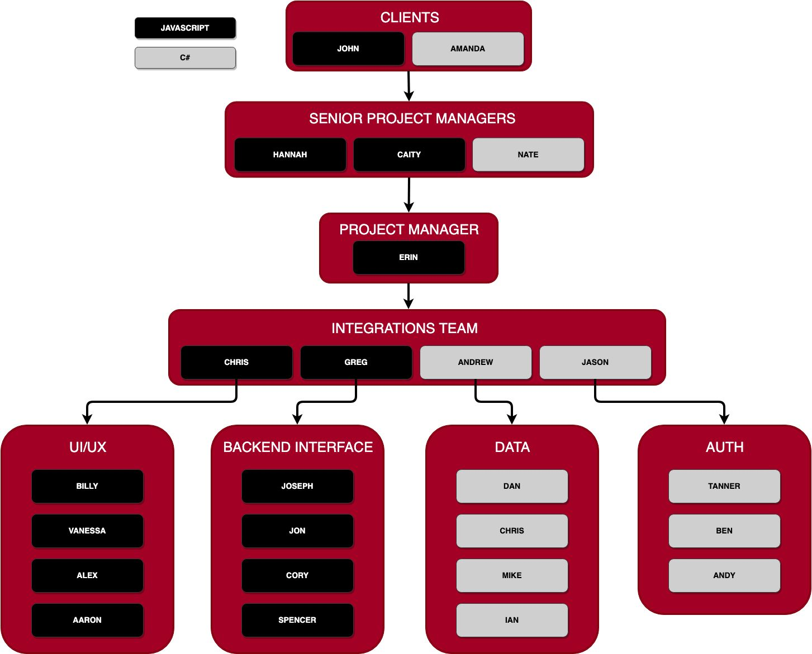

# 401 Snowflakes Final Project
This is a joint final project between the 401 Javascript and 401 ASP.Net classes at Code Fellows in Seattle, WA. The project will be completed in only 4 days between May 20 - May 24 2019.

---
## Project Name: Curve
---
#### Goal
Recreate the Medium **_Snowflake_** app for Code Fellows employee and student core competancy evaluations. Adapt the core competancies used in the careers curriculum as metrics. The front end should use React, and Gatsby JS while the backend should serve the required data to the front end using GraphQL while providing for a variety of different roles and permissions.

---

#### Notes from Client (Brooke)
_Conversation 5/16/19_: All of the sub competancies and main competancies will have a maximum score of 4. The snowflake should graphically show ALL of the main competancies and subcompetancies. Each primary compentancy will have a different color (or shade). Use the [Engineering Competancy Matrix Scoring Guide](https://docs.google.com/spreadsheets/d/131XZCEb8LoXqy79WWrhCX4sBnGhCM1nAIz4feFZJsEo/edit#gid=0) as a guide for the requirements to move to the next level in score.

---

#### Project Descriptions
_Pending_

#### Roles and Responsibiities
_Pending_

#### GitHub Flow
_Pending_

#### Daily Schedule
_Pending_

---

<h2 align="center">Team Hierarchy</h2>

#### Integrations Team
* Team Leader: Pending
* [Group Agreement]() - Link Pending
* [User Stories]() - Link Pending
#### UI/UX - Javascript
* Integrations Team Point of Contact: Chris
* Team Leader: Pending
* [Group Agreement]() - Link Pending
* [User Stories]() - Link Pending
#### Backend Interface - Javascript
* Integrations Team Point of Contact: Greg
* Team Leader: Spencer Hirata
* [Group Agreement](https://docs.google.com/document/d/1zHWas520gGabNYsYsWhnB7dGbvR6hwNa1sw3Oxc140w/edit)
* [User Stories]() - Link Pending
#### Data - C#
* Integrations Team Point of Contact: Andrew
* Team Leader: Pending
* [Group Agreement]() - Link Pending
* [User Stories]() - Link Pending
#### Auth - C#
* Integrations Team Point of Contact: Jason
* Team Leader: Pending
* [Group Agreement]() - Link Pending
* [User Stories]() - Link Pending

### Languages Used
* JavaScript
* C#

### Tools Used
* GraphQL
* Gatsby JS
* D3

### Meeting Notes
[Pre-Project Team Meeting](./meeting-notes/pre-project-team-meeting-051619.pdf)
### Resources
**General Project References**
  * [Deployed Site To Be Emulated](https://snowflake.medium.com/#1,2,3,2,4,1,1,4,3,2,0,4,2,2,3,0,Cersei%20Lannister,Staff%20Engineer)
  * [Source Code of Deployed Site](https://github.com/Medium/snowflake)
  * [Code Fellows Core Competancies to Be Included in Modified Application](https://codefellows.github.io/common_curriculum/career_coaching/Professional_Competencies)
  * [Engineering Competancy Matrix Scoring Guide](https://docs.google.com/spreadsheets/d/131XZCEb8LoXqy79WWrhCX4sBnGhCM1nAIz4feFZJsEo/edit#gid=0)
  * [Project Team Google Doc](https://docs.google.com/spreadsheets/d/1CzgWm-3V0Jk-84M-uYPgu6QCUdVDnjP8DKf4bb2aTeM/edit?usp=sharing)

**GraphQL Resources (.NET)**
  * [GraphQL .NET](https://graphql-dotnet.github.io/docs/getting-started/introduction/)
  * [Building GraphQL APIs with ASP.NET Core](https://medium.com/volosoft/building-graphql-apis-with-asp-net-core-419b32a5305b)

**GraphQL Resources (JavaScript)**
  * [GraphQL Docs for JavaScript](https://graphql.org/code/#javascript)
  * [Full Stack Tutorial](https://www.howtographql.com/)
  * [Best resources to learn React & GraphQL](https://dev.to/robmatyszewski/best-resources-to-learn-react-graphql-5dkk)

**D3 Resources (Javascript)**
  * [D3 Main Site](https://d3js.org/)
  * [Learn D3 in 5 Minutes](https://medium.freecodecamp.org/learn-d3-js-in-5-minutes-c5ec29fb0725)
  * [Free D3 Tutorials by Scrimba](https://scrimba.com/g/gd3js)

**Gatsby JS Resources (JavaScript)**
  * [Gatsby JS Website](https://www.gatsbyjs.org/)
  * [Official Gatsby JS Tutorial](https://www.gatsbyjs.org/tutorial/)
  * [Querying Data in Gatsby JS with GraphQL](https://www.gatsbyjs.org/docs/querying-with-graphql/)
  * [Gatsby Video Tutorial - 1 Hour](https://www.youtube.com/watch?v=6YhqQ2ZW1sc)
  * [Gatsby Video Bootcamp Tutorial - 4 Hours](https://www.youtube.com/watch?v=8t0vNu2fCCM)

**Design Resources**
  * [Code Fellows Style Guide]() - Link Pending
